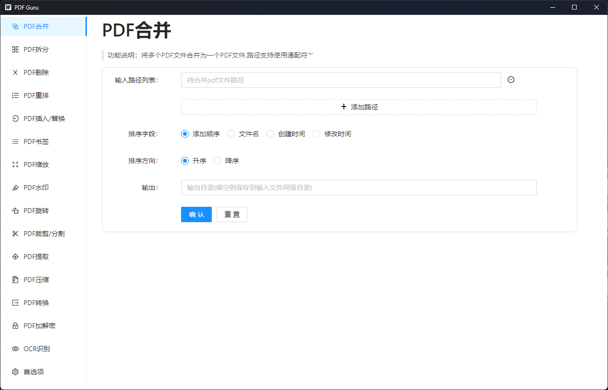

# PDF Guru

PDF Guru是一个包含多种常用实用功能的PDF文件处理工具，具有简单易用的界面。

## Description

支持下列操作：
* PDF合并: 将多个PDF文件合并为一个文件,支持对要合并的多个文件按照文件名、创建时间、修改时间等进行排序后再合并
* PDF拆分: 支持均匀分块、自定义范围、根据目录拆分等多种拆分方式。
* PDF页面删除：支持删除指定范围的页面，支持批处理操作
* PDF页面插入: 在指定位置插入另一个PDF文件(的部分页面)
* PDF页面替换: 将指定范围的页面用另一个PDF文件(的指定范围页面)替换
* PDF页面旋转: 支持旋转指定范围的页面，支持批处理
* PDF页面裁剪: 支持裁剪指定范围的页面，支持批处理
* PDF页面分割: 支持均匀分割、自定义分割等多种分割方式
* PDF页面重排: 支持重新调整页面排列顺序,支持批处理
* PDF页面缩放: 支持缩放指定范围的页面,支持批处理
* PDF书签：提取书签、添加书签、OCR识别书签等
* PDF压缩: 支持对PDF文件进行压缩,支持批处理
* PDF提取: 提取文本、字体、图片、表格等
* PDF转换: 支持pdf转图片、图片转pdf、pdf转docx等多种格式转换
* PDF加解密: 支持设置打开密码和权限密码，也支持对加密PDF解密
* PDF水印: 支持添加文本、图片水印,也支持去除常见水印
* OCR识别: 支持对PDF页面进行OCR识别，支持双栏识别

## Getting Started
### Installing

* How/where to download your program
* Any modifications needed to be made to files/folders

### Usage
1. PDF合并
2. PDF拆分
3. PDF删除
4. PDF重排
5. PDF插入
5. PDF替换
5. PDF书签
5. PDF缩放
5. PDF水印
5. PDF旋转
5. PDF裁剪
5. PDF分割
5. PDF提取
5. PDF压缩
5. PDF转换
5. PDF加解密
5. OCR识别

## Authors

[@Kevin2li](https://github.com/kevin2li)

## License

This project is licensed under the MIT License - see the [LICENSE](LICENSE) file for details

## Acknowledgments

* [wails](https://github.com/wailsapp/wails)
* [PyMuPDF](https://pymupdf.readthedocs.io/en/latest/)
* [PyPDF](https://github.com/py-pdf/pypdf)