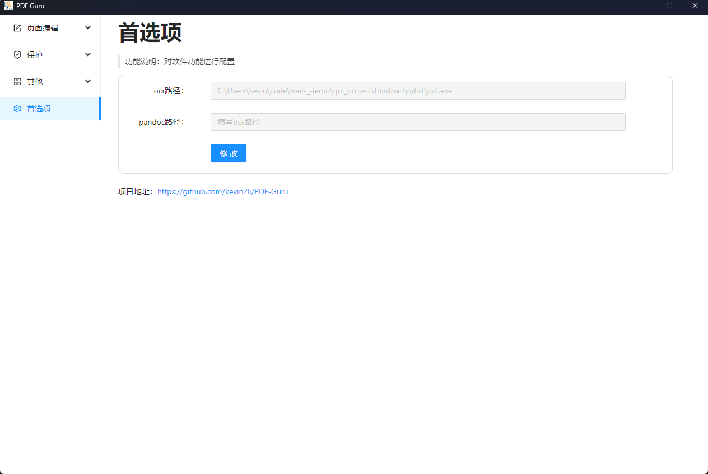

# PDF Guru  
<p align="left">
 
</p>

<p align="left">
    <a href="./LICENSE"></a>
    <a href="https://github.com/kevin2li/PDF-Guru/releases"></a>
    <a href=""></a>
    <a href=""></a>
</p

- [PDF Guru](#pdf-guru)
  - [项目介绍](#项目介绍)
  - [上手指南](#上手指南)
    - [安装](#安装)
    - [使用](#使用)
  - [Authors](#authors)
  - [License](#license)
  - [Acknowledgments](#acknowledgments)

## 项目介绍
[PDF Guru](https://github.com/kevin2li/PDF-Guru)是一个通用型PDF文件处理工具，包含PDF合并、拆分、旋转、水印、加密、转换等20多项常用功能，完全开源，个人免费使用，界面简洁，简单易用。


虽然目前网上关于PDF处理的工具有很多，但是都有一些缺点：
1. 专业的PDF编辑软件对于高级一点的功能（添加水印、页面编辑等）需要收费或限制功能
2. 在线PDF工具类网站需要上传PDF到服务器处理再下载，有泄露隐私风险
3. 各大编程语言的PDF处理库虽然可以免费实现一些高级功能，但是需要一定的编程经验，使用没有图形界面程序方便
4. 部分小众工具虽然可以满足部分特殊需求，但是功能较为单一


由于PDF处理是一个很常见的需求，为了绕开上述这些限制，提高工作效率，诞生了此项目。

本项目具有如下优势：
1. 完全本地化：无需联网，不必担心隐私泄露
2. 功能丰富：支持包括PDF批量合并、拆分、添加水印、加密/解密、提取、OCR识别在内的20余项功能
3. 跨平台：支持在Windows、Mac设备上使用
4. 开源免费
5. 界面简洁，使用简单
6. 体积小巧，绿色免安装，随用随开
7. 插件化：根据需要选择是否安装额外组件，减小安装包体积

## 上手指南
### 安装

- 二进制安装

去[Releases](https://github.com/kevin2li/PDF-Guru/releases)版块下载对应平台的安装包安装即可。

- 编译安装

1. 安装[go](https://go.dev/dl/)环境、[node](https://nodejs.org/en/download/)环境和[python](https://docs.conda.io/en/latest/miniconda.html)环境

```bash
# 确认go安装成功
go version

# 确认 "~/go/bin" 位于PATH环境变量中
echo "export PATH=$PATH:$HOME/go/bin" >> $HOME/.bashrc
source $HOME/.bashrc
echo $PATH | grep go/bin

# 确认nodejs安装成功
npm --version
```

2. 编译项目

```bash
git clone https://github.com/kevin2li/PDF-Guru.git
cd PDF-Guru
ROOT=$(pwd)
go install github.com/wailsapp/wails/v2/cmd/wails@latest
go mod tidy

# 安装前端依赖
cd ${ROOT}/frontend
npm install

# 安装后端环境
cd ${ROOT}/thirdparty
pip install pymupdf reportlab pillow loguru pyinstaller
pyinstaller -F -w pdf.py
mkdir ${ROOT}/build/bin

# 1) for darwin, linux
cp dist/pdf ocr.py convert.py ${ROOT}/build/bin

# 2) for windows
cp dist/pdf.exe ${ROOT}/build/bin
cp ocr.py ${ROOT}/build/bin
cp convert.py ${ROOT}/build/bin

cd $ROOT
wails dev # 开发预览
wails build # 编译
```

将`build/bin`目录打包，运行`PDF Guru`即可。

<details close>
<summary><h4>额外安装(可选)</h4></summary>
软件中大部分功能可直接使用，无需安装额外东西，但是部分功能如ocr相关功能等因打包进来会导致安装包太大，供有需要的用户自行安装依赖环境。需要额外安装的功能会在软件中用蓝色标签标注，如下：


<h4>Python环境</h4>

如果你需要使用到OCR相关功能(识别PDF书签、提取表格等)，可以继续此部分的设置。

项目使用了[PaddleOCR](https://github.com/PaddlePaddle/PaddleOCR)提供ocr文字识别服务，因此需要安装paddleocr环境，并在软件“首选项”中指定虚拟环境中python解释器路径。具体步骤如下：

1. 安装python环境(推荐[miniconda](https://docs.conda.io/en/latest/miniconda.html))
2. 创建虚拟环境,并安装paddleocr
```bash
# 创建环境
conda create -n ocr python=3.10

# 激活环境
conda activate ocr

# 安装paddlepaddle和paddleocr
pip install paddlepaddle -i https://pypi.tuna.tsinghua.edu.cn/simple
pip install "paddleocr>=2.0.1"
```

3. 查看环境中python解释器路径

可以通过`conda env list`命令查看`ocr`环境的绝对路径, 注意下面的`{用户名}`请根据自己实际情况进行替换。

 - windows

如:`C:\Users\{用户名}\miniconda3\envs\ocr\`  
则python解释器路径为：`C:\Users\{用户名}\miniconda3\envs\ocr\python.exe`

  - Mac

如:`/Users/{用户名}/miniconda3/envs/ocr`  
则python解释器路径为：`/Users/{用户名}/miniconda3/envs/ocr/bin/python`

  - Linux

如:`/home/{用户名}/miniconda3/envs/ocr`  
则python解释器路径为：`/home/{用户名}/miniconda3/envs/ocr/bin/python`

4. 在PDF Guru的“首选项”中配置装有paddleocr的python路径



<h4>Pandoc</h4>

Pandoc是一种开源的命令行工具，可用于将各种文档格式之间进行转换。

https://pandoc.org/installing.html

如果看到带有`pandoc`标记的功能，需要先安装pandoc
</details>

### 使用

**总体说明**：

1. 页码格式

|举例|含义|
|-|-|
|1|第1页|
|1-3|第1-3页(包含第3页)|
|1-N|第1页到最后一页(包含最后一页)|
|1-3,7,9-10|第1-3页、第7页和第9-10页，注意使用英文逗号分隔多个页码区间|

2. 页码编号

所有需要填页码的地方都是从1开始编号

3. 路径格式

全部使用绝对路径，类似：`C:\Users\kevin\Downloads\test.txt`, 注意不要用引号包裹路径。

> 如何快速获取文件绝对路径?
> 1. Windows下可以选中目标文件后使用`Ctrl+Shift+C`快速复制文件绝对路径。
> 2. MacOS下可以选中目标文件后使用`Command+Opion+C`快速复制文件绝对路径。

软件会自动检测路径是否存在，不合法的路径将不会被通过，也不会进行继续的处理。

如果想批量操作，可以使用通配符`*`。
例如批量对PDF文件进行旋转，路径可以填`C:\Users\kevin\Downloads\*.pdf`，将会匹配`C:\Users\kevin\Downloads`目录下所有的PDF文件。除少数功能(插入/替换等)外，大部分都支持批量操作。

4. 坐标

所有需要填坐标的地方(如设置锚框等)都是以左上角点为原点。


**具体功能**：

1. PDF插入/替换

插入：支持插入空白页和插入其他文件两种选项。


替换：用目标PDF的指定页码范围来替换源PDF中指定的页码范围(此处的页码范围只支持`1`或`1-3`两种方式)


2. PDF合并

将多个PDF文件合并为一个整体PDF文件，支持自定义排序方式。


3. PDF拆分

将大的PDF文件拆分为若干个小的文件，支持多种拆分方式，如均匀分块、自定义范围、按目录级别拆分等。


4. PDF旋转

将PDF指定页面范围进行旋转。


5. PDF删除

删除PDF中的指定页面。


6. PDF重排

对PDF的页面顺序进行重排列。


7. PDF裁剪

对PDF页面进行裁剪。


8. PDF缩放

对PDF页面进行缩放。


9. PDF分割

将PDF页面拆分成若干个子页面，支持网格均匀分割和自定义分割方式。


10. PDF组合

将多个PDF页面合并为单个页面。


11. 页眉页脚

设置PDF的页眉页脚。


12. 页码设置

为PDF文件添加页码，内置了多种页码样式，也支持自定义页码样式。


13. 文档背景

为PDF文档设置背景，支持使用颜色和图片作为背景。


14. PDF水印

为PDF文档添加水印，也提供了多种方式去除PDF文档水印(仅为提升阅读体验使用，切勿滥用侵权)

添加水印：支持文本、图片、PDF文档三种形式的水印添加，其中文本水印支持字体、字号、颜色、不透明度等多种属性控制，支持设置多行水印等。


去除水印：支持多种水印去除方式，可根据实际情况选择合适的方式(不保证绝对有效)。


视频教程: [https://www.bilibili.com/video/BV1Qz4y1E7vq/](https://www.bilibili.com/video/BV1Qz4y1E7vq/)

15. PDF加密/解密

给PDF文档设置密码，包括打开密码和权限密码。也支持对PDF文档进行解密并恢复权限。


16. PDF书签

支持提取PDF书签、写入PDF书签，甚至使用ocr技术自动识别PDF书签(需要额外安装paddleocr环境)


视频教程：[https://www.bilibili.com/video/BV1Wx4y1o7P6/](https://www.bilibili.com/video/BV1Wx4y1o7P6/)

17. PDF提取

提取PDF文档中的页面、文本、图片等


18. PDF压缩

对PDF文档进行压缩减小体积。


19. PDF转换

提供PDF与其他格式之间的转换。部分转换需要pandoc(需要额外安装)的支持。


20. OCR识别

对PDF页面进行OCR识别，也支持对图片的OCR识别。


21. 双层PDF制作
> 此功能依赖tesseract ocr，下载地址：[https://github.com/UB-Mannheim/tesseract/wiki](https://github.com/UB-Mannheim/tesseract/wiki)


依赖安装：https://tesseract-ocr.github.io/tessdoc/#binaries

语言包下载：
- 中文包下载：https://github.com/tesseract-ocr/tessdata/blob/3.04.00/chi_sim.traineddata

放到安装目录的`tessdata`目录下(默认为`C:\Program Files\Tesseract-OCR\tessdata`)即可。


22. 首选项

对于额外安装的功能需要在此处进行配置，即填写外部工具的可执行文件路径。


## Authors

[@Kevin2li](https://github.com/kevin2li)

## License

This project is licensed under the AGPL-3.0 License - see the `LICENSE` file for details

## Acknowledgments

* [wails](https://github.com/wailsapp/wails)
* [PyMuPDF](https://pymupdf.readthedocs.io/en/latest/)
* [ReportLab](https://www.reportlab.com)
* [PaddleOCR](https://github.com/PaddlePaddle/PaddleOCR)
