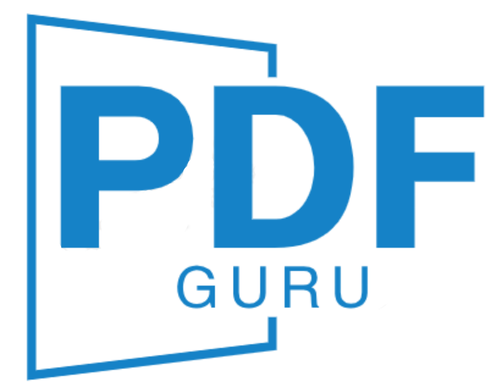

# PDF Guru Anki  

 

    
    
    
    
    
    

 国内用户可访问：https://gitee.com/Kevin234/PDF-Guru

## 项目介绍

**[PDF Guru Anki](https://guru.kevin2li.top/)** 是一款以PDF为中心的**多功能办公学习工具箱**软件，目前包含四大板块功能：
1. **PDF实用工具箱**，包含PDF水印去除、PDF批量添加书签、PDF批量OCR、PDF转换等众多超实用功能。
2. **Anki制卡神器**, 支持『PDF、Word、Xmind、幕布、Markdown、Excel、微信读书、欧陆词典』等众多类型材料快速制作Anki卡片，支持挖空题、问答题、选择题等常见题型批量制卡，有效解决Anki卡片制作过程繁杂、效率低下等问题，可以为用户节省大量时间来专注于学习本身。
3. **Anki最强辅助**, 大幅拓展了Anki的周边功能，包含自建同步服务器、Anki卡片导出PDF、字段批量修改替换、批量添加发音、图片批量上传图床等众多实用功能，让您使用Anki更加得心应手。
4. **视频笔记神器**, 支持边看视频边记笔记，方便快捷地在笔记中插入视频时间戳和视频截图，同时支持时间戳回链跳转，实现笔记高效记录和后期回顾，将做好的笔记搭配本软件的Anki制卡功能一键导入Anki，打造学习从记录归纳到复习背诵的完美闭环。

一句话，本软件功能众多且强大，熟练运用可以大幅提高办公和学习效率，绝对是您不可多得的效率神器。人生苦短，我用Guru!

## 目标用户

本软件受众非常广泛，理论上任何有**日常办公**和**学习备考**需要的人群都可从本软件中受益，极大提高办公和学习效率。

具体来说，如果您符合下面中的一条及以上，那么这款软件适合您：

### 办公人士

本软件包含丰富的PDF处理功能，包括但不限于：

- **PDF基础操作**：包含合并、拆分、调整页面顺序、旋转等各种功能，并且支持批量处理
- **PDF去水印**：支持多种去水印方法，可去除大部分常见的水印，并且支持批量处理
- **PDF书签**：支持快速添加PDF书签，支持从书签文件导入、自动识别等多种添加方式
- **PDF转换**：支持PDF转图片、图片转PDF、PDF转Word等众多转换工具
- **PDF批量OCR**: 快速识别提取PDF中的文字，支持批量识别
- **双层PDF制作**：一键制作双层PDF，标书制作不再困难！

### 学生群体

学生的主要任务是学习和应对各类考试，小到期中期末考试，大到高考、研究生入学考试、公务员考试等等，无不需要进行大量的练习和反馈来达到良好的学习效果。Anki正是这样一款帮助您高效学习的软件，本软件提供了大量丰富的Anki制卡功能，可以从PDF、Word、思维导图等各类材料中批量导入Anki卡片，帮助您高效通过各类考试！

部分功能举例：

- **PDF制卡**：可以使用PDF批注功能边学习边做笔记，也可以对错题进行批注制作错题集，然后直接导入制卡，支持问答题和挖空题
- **Word制卡**：可以使用PDF批注功能边学习边做笔记，然后直接导入制卡，支持问答题和挖空题
- **思维导图制卡**：支持Xmind、幕布等导图软件直接转Anki卡片，支持问答题和挖空题
- **单词制卡**：支持从PDF、欧陆词典、有道词典等来源转Anki卡片
- **选择题批量制卡**：将选择题题库一键快速导入Anki，方便练习和巩固，快速掌握知识点
- **微信读书制卡**：支持将微信读书笔记导入Anki，有效避免读书遗忘问题
- **视频笔记**：利用视频笔记功能，快速插入时间戳和视频截图，并支持回链跳转回视频指定位置，做好的笔记也可以方便导入 Anki，方便后续复习。

### 职场上班族

可以使用本软件：
- **快速掌握工作内容**，记忆工作相关的专业知识，高效掌握公司培训材料，助您快速适应工作内容！
- **准备各类职业资格考试**，如会计证、法律职业资格考试等，提升在职场中的竞争力，升职加薪不是梦！
- **提升自己学历**，如备考研究生考试等，让学历不再成为未来发展的瓶颈！
- **准备公务员考试**，宇宙的尽头是考公，使用本软件帮您高效备考！

### 家长群体
"**不要让孩子输在起跑线上**"，当下越来越多的家长们开始重视孩子教育，尤其是小学和初中生家长。您可以使用本软件：
- **制作识字卡片**，帮助孩子快速认识中国汉字的辨认和笔画书写
- **制作英语单词卡片**，帮助孩子从小养成英语的语感
- **制作习题集卡片**，帮助孩子高效掌握课本知识点

### 教育工作者

- **教师群体**：您可以将教学材料转换为Anki卡片，发放给学生学习巩固，提高学生学习效率！
- **知识博主**：您可以使用本软件将自己熟悉的领域知识点(如考研各类资料)等，做成Anki牌组分享到网上，帮助别人快速掌握知识点，提升自己的影响力

## 安装与使用教程

详见软件官网：[https://guru.kevin2li.top/](https://guru.kevin2li.top/)

## Star History

## Authors

[@Kevin2li](https://github.com/kevin2li)

## License

This project is licensed under the AGPL-3.0 License - see the `LICENSE` file for details

## Acknowledgments

* [wails](https://github.com/wailsapp/wails)
* [PyMuPDF](https://pymupdf.readthedocs.io/en/latest/)
* [ReportLab](https://www.reportlab.com)
* [PaddleOCR](https://github.com/PaddlePaddle/PaddleOCR)
