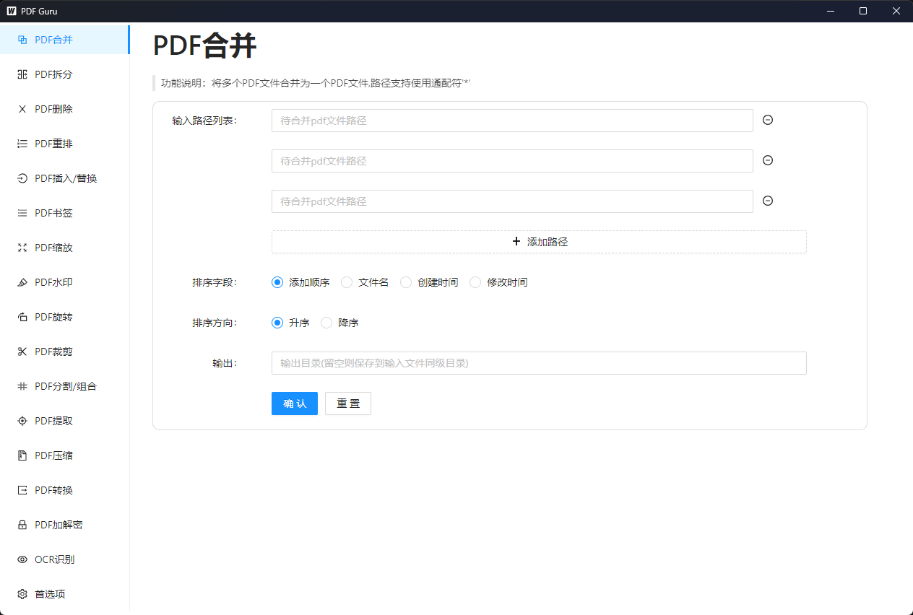

# PDF Guru  
## 项目介绍
目前网上的PDF处理工具有很多，但是都有一些缺点：
1. 专业的PDF编辑软件对于高级一点的功能（添加水印、页面编辑等）需要收费或限制功能
2. 在线PDF工具类网站需要上传PDF到服务器处理再下载，有泄露隐私风险
3. 各大编程语言的PDF处理库虽然可以免费实现一些高级功能，但是需要一定的编程经验，使用没有图形界面程序方便
4. 部分小众工具虽然可以满足部分特殊需求，但是功能较为单一
5. ...

由于PDF处理是一个很常见的需求，为了绕开上述这些限制，提高工作效率，诞生了此项目。

本项目具有如下优势：
1. 完全本地化：无需联网，不必担心隐私泄露
2. 功能丰富：支持包括PDF批量合并、拆分、添加水印、加密/解密、提取、OCR识别在内的20余项功能
3. 跨平台：支持在Windows、Mac设备上使用
4. 开源免费
5. 界面简洁，使用简单
6. 体积小巧，绿色免安装，随用随开
7. ...


## 功能特性

[PDF Guru](https://github.com/kevin2li/PDF-Guru)是一个通用型PDF文件处理工具，包含20多项常用功能，完全开源，界面简洁，使用方便。



软件支持的操作有(包括但不限于)：

* PDF合并: 将多个PDF文件合并为一个文件,支持对要合并的多个文件按照文件名、创建时间、修改时间等进行排序后再合并
* PDF拆分: 支持均匀分块、自定义范围、根据目录拆分等多种拆分方式。
* PDF页面删除：支持删除指定范围的页面，支持批处理操作
* PDF页面插入: 在指定位置插入另一个PDF文件(的部分页面)
* PDF页面替换: 将指定范围的页面用另一个PDF文件(的指定范围页面)替换
* PDF页面旋转: 支持旋转指定范围的页面，支持批处理
* PDF页面裁剪: 支持裁剪指定范围的页面，支持批处理
* PDF页面分割: 支持均匀分割、自定义分割等多种分割方式
* PDF页面重排: 支持重新调整页面排列顺序,支持批处理
* PDF页面缩放: 支持缩放指定范围的页面,支持批处理
* PDF书签：提取书签、添加书签、OCR识别书签等
* PDF压缩: 支持对PDF文件进行压缩,支持批处理
* PDF提取: 提取文本、字体、图片、表格等
* PDF转换: 支持pdf转图片、图片转pdf、pdf转docx等多种格式转换
* PDF加解密: 支持设置打开密码和权限密码，也支持对加密PDF解密
* PDF水印: 支持添加文本、图片水印,也支持去除常见水印
* OCR识别: 支持对PDF页面进行OCR识别，支持双栏识别

## 上手指南
### 安装
去[Releases]()版块下载对应平台的安装包安装即可。

**额外设置(可选)**  

如果你需要使用到OCR相关功能(识别PDF书签、提取表格等)，可以继续此部分的设置。

项目使用了[PaddleOCR]()提供ocr文字识别服务，因此需要安装paddleocr环境，并在软件“首选项”中指定虚拟环境中python解释器路径。具体步骤如下：

1. 安装python环境(推荐[miniconda](https://docs.conda.io/en/latest/miniconda.html))
2. 创建虚拟环境,并安装paddleocr
```bash
# 创建环境
conda env create -n ocr python=3.10

# 激活环境
conda activate ocr

# 安装paddlepaddle和paddleocr
pip install paddlepaddle -i https://pypi.tuna.tsinghua.edu.cn/simple
pip install "paddleocr>=2.0.1"
```
3. 查看环境中python解释器路径

可以通过`conda env list`命令查看`ocr`环境的绝对路径，如:`C:\Users\{用户名}\miniconda3\envs\ocr\`

则python解释器路径为：`C:\Users\{用户名}\miniconda3\envs\ocr\python.exe`

4. 在PDF Guru的“首选项”中配置ocr路径


### 使用
1. [PDF合并](doc/PDF%E5%90%88%E5%B9%B6.md)
2. [PDF拆分]()
3. [PDF删除]()
4. [PDF重排]()
5. [PDF插入]()
5. [PDF替换]()
5. [PDF书签]()
5. [PDF缩放]()
5. [PDF水印]()
5. [PDF旋转]()
5. [PDF裁剪]()
5. [PDF分割]()
5. [PDF提取]()
5. [PDF压缩]()
5. [PDF转换]()
5. [PDF加解密]()
5. [OCR识别]()


## Authors

[@Kevin2li](https://github.com/kevin2li)

## License

This project is licensed under the MIT License - see the `LICENSE` file for details

## Acknowledgments

* [wails](https://github.com/wailsapp/wails)
* [PyMuPDF](https://pymupdf.readthedocs.io/en/latest/)
* [PaddleOCR](https://github.com/PaddlePaddle/PaddleOCR)
